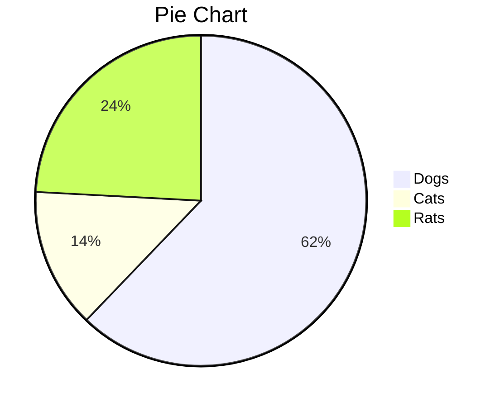
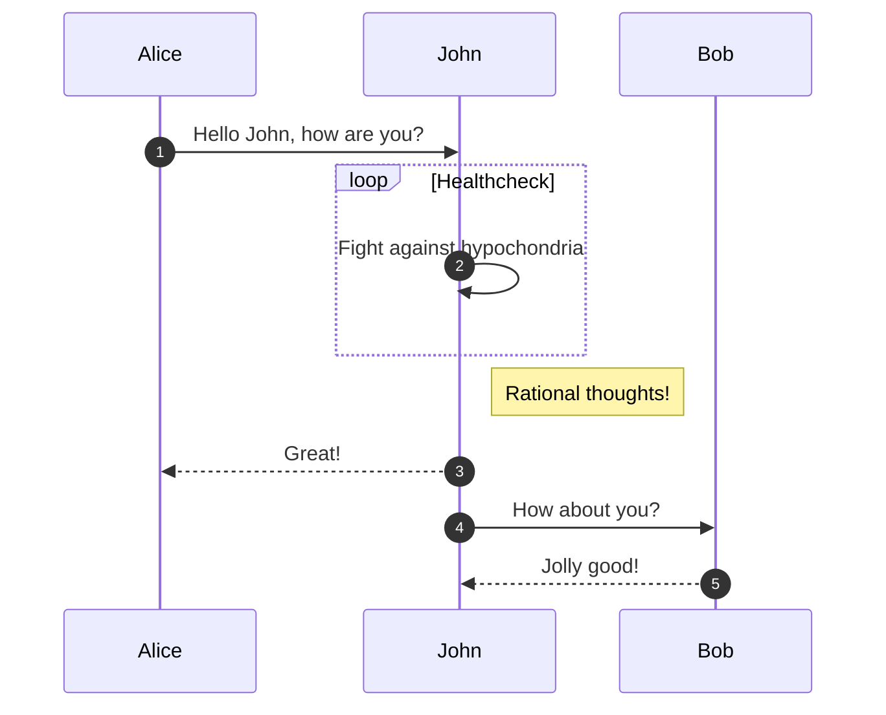

test document in markdown

Интересно как быстро сюда добавляется новый текст

| Колонка 1 | Колонка 2 | Колонка 3 |
| --------- | --------- | --------- |
| Ряд 1     |           |           |
| Ряд 2     |           |           |
| Ряд 3     |           |           |

Picture

