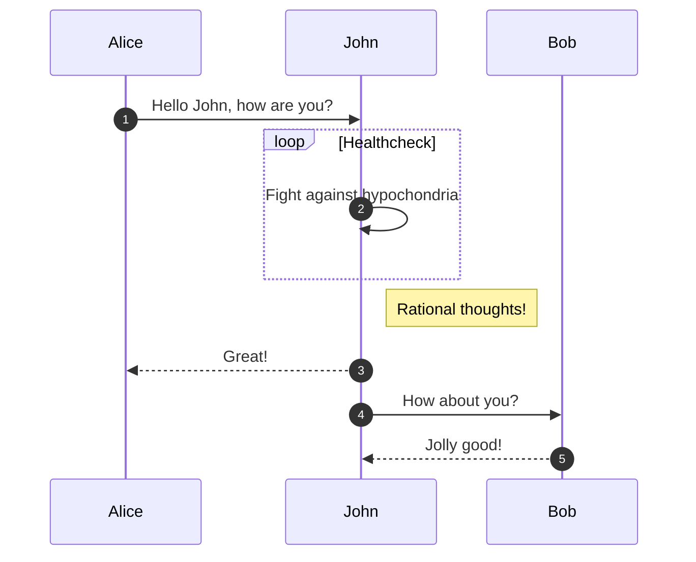

# Примеры медиа вставок

#### Таблица

Чтобы комфортно работать с таблицами в markdown, нужен редактор который поддерживает WYSIWYG редактирование таблиц. Например, Typora или Obsidian. Тем не менее функционал работы с таблицами беден в сравнении с notion или coda. Таблица в markdown это как простая таблица в notion в которой нельзя делать ни сортировку, ни ссылки на другие таблицы.

| Колонка 1 | Колонка 2 | Колонка 3 |
| --------- | --------- | --------- |
| Ряд 1     |           |           |
| Ряд 2     |           |           |
| Ряд 3     |           |           |

Картинка 

Диаграмма mermaid

